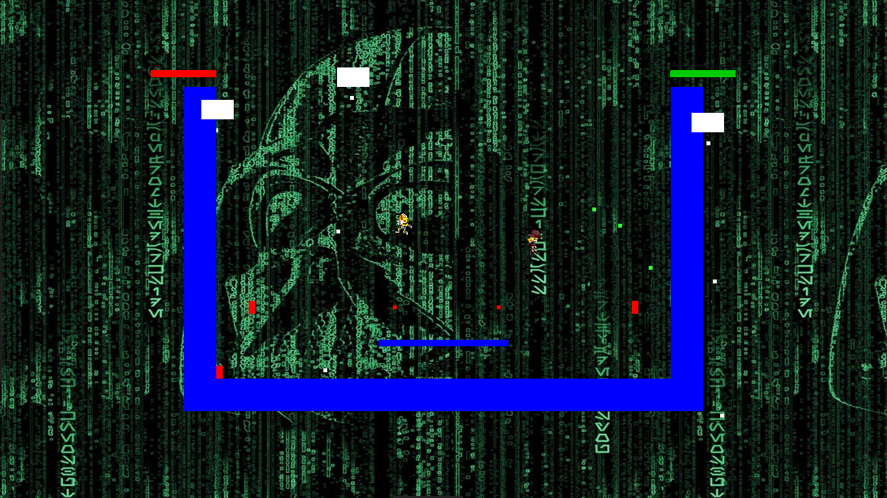

# guns-n-fun

[](https://travis-ci.org/cmc-haskell-2018/guns-n-fun)

Игра в жанре платформер-шутер.


## Сборка и запуск
<!--
Соберите проект при помощи [утилиты Stack](https://www.haskellstack.org):

```
stack setup
stack build
```

Собрать и запустить проект можно при помощи команды

```
stack build && stack exec guns-n-fun
```

Запустить тесты можно при помощи команды

```
stack test
```

Чтобы запустить интепретатор GHCi и автоматически подгрузить все модули проекта, используйте команду

```
stack ghci
```
-->

Управление:
 Управление движением спрайта для первого игрока - w,a,d;
 Управление движением спрайта для первого игрока - стрелки вверх, влево, вправо.
 Стрельба - игрок 1 - 'q', игрок 2 - 'l'


Ubuntu build instructions:
1. Firstly, install [cabal](https://www.haskell.org/cabal/) and [haskell platform](https://www.haskell.org/platform/#linux-ubuntu)
```
sudo apt install cabal-install haskell-platform
```
2. clone this repo
3. update and install dependencies:
```
cabal update
cabal install gloss
cabal install gloss-juicy-0.2.3
cabal install
```
4. launch project
```
cabal run
```
5. Have fun!
